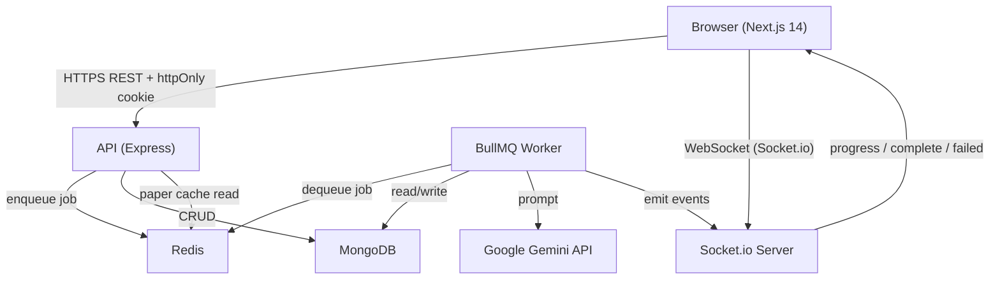
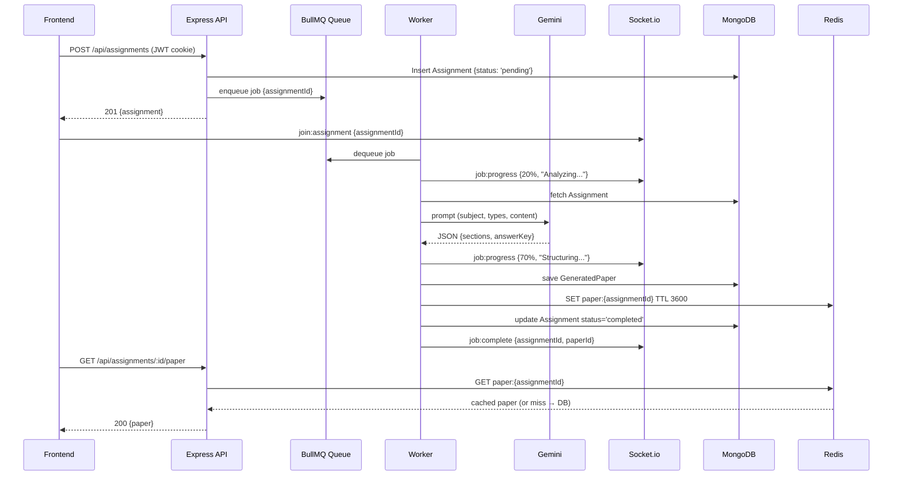

# Design Document — VedaAI AI Assessment Creator

## Overview

VedaAI is a teacher-facing web platform that lets educators configure assignment parameters and receive AI-generated, curriculum-aligned question papers in real time. The system is built as a monorepo containing a Next.js 14 frontend, a Node.js/Express API, a BullMQ background worker, MongoDB for persistence, and Redis for job queuing and paper caching.

The core user journey is:

1. Teacher registers or signs in (email/password or Google OAuth).
2. Teacher completes a two-step wizard to configure an assignment (question types, marks, reference document, metadata).
3. The API persists the assignment and enqueues a BullMQ job.
4. The Worker calls Google Gemini, parses the response, saves the `GeneratedPaper`, and emits real-time WebSocket progress events.
5. The Frontend displays the formatted paper, allows the teacher to toggle the answer key, and offers a one-click PDF download.

### Key Design Goals

- **Real-time feedback**: WebSocket rooms per assignment keep the teacher informed without polling.
- **Resilience**: BullMQ retry logic and Redis caching decouple generation latency from the HTTP request cycle.
- **Type safety**: A shared `packages/shared` package ensures the frontend and backend agree on every data shape.
- **Security by default**: JWT in httpOnly cookies, Helmet, rate limiting, magic-byte MIME validation, and prompt sanitization are applied uniformly.
- **Mobile-first**: Responsive breakpoints, a bottom tab bar on mobile, and 44 × 44 px touch targets throughout.

---

## Architecture

### High-Level Component Diagram



### Deployment Topology (Docker Compose)

| Service   | Image              | Port  | Depends On          |
|-----------|--------------------|-------|---------------------|
| mongodb   | mongo:7            | 27017 | —                   |
| redis     | redis:7-alpine     | 6379  | —                   |
| api       | custom (Node.js)   | 5000  | mongodb, redis      |
| web       | custom (Next.js)   | 3000  | api                 |

The Worker runs inside the `api` container as a separate process (or a sibling module bootstrapped at startup), sharing the same MongoDB and Redis connections.

### Request Lifecycle — Assignment Creation



---

## Components and Interfaces

### Backend Components

#### Auth Service (`apps/api/src/services/auth.service.ts`)

Responsibilities: user registration, login, Google OAuth callback handling, JWT issuance, and session validation.

Key methods:
```typescript
register(dto: RegisterDto): Promise<{ user: IUser; token: string }>
login(dto: LoginDto): Promise<{ user: IUser; token: string }>
handleGoogleCallback(profile: GoogleProfile): Promise<{ user: IUser; token: string }>
verifyToken(token: string): JwtPayload
getMe(userId: string): Promise<IUser>
```

JWT configuration:
- Algorithm: HS256
- Expiry: `7d`
- Payload: `{ sub: userId, iat, exp }`
- Transport: `Set-Cookie: token=<jwt>; HttpOnly; SameSite=Lax; Path=/; Max-Age=604800`

#### Assignment Service (`apps/api/src/services/assignment.service.ts`)

Responsibilities: CRUD for assignments, ownership enforcement, job enqueueing.

Key methods:
```typescript
create(userId: string, dto: CreateAssignmentDto): Promise<IAssignment>
list(userId: string): Promise<IAssignment[]>
getById(userId: string, assignmentId: string): Promise<IAssignment>
deleteById(userId: string, assignmentId: string): Promise<void>
regenerate(userId: string, assignmentId: string): Promise<IAssignment>
```

Ownership check pattern (applied in `getById`, `deleteById`, `regenerate`):
```typescript
if (assignment.userId.toString() !== userId) throw new ForbiddenError();
```

#### Generation Service / Worker (`apps/api/src/workers/generation.worker.ts`)

Responsibilities: consume BullMQ jobs, build Gemini prompts, parse responses, persist `GeneratedPaper`, update Redis cache, emit WebSocket events.

BullMQ queue name: `"question-generation"`

Worker concurrency: 1 (sequential processing to avoid Gemini rate-limit bursts)

Retry strategy: 1 automatic retry with a stricter prompt (explicit JSON-only instruction) before marking failed.

Prompt sanitization helper:
```typescript
function sanitizeForPrompt(input: string): string {
  // Strip characters that could break JSON structure or inject instructions
  return input.replace(/[`\\]/g, '').replace(/\n{3,}/g, '\n\n').trim();
}
```

#### File Processor (`apps/api/src/services/file.service.ts`)

Responsibilities: Multer memory-storage upload, magic-byte MIME validation via `file-type`, PDF text extraction via `pdf-parse`, image URL storage.

Validation order:
1. File presence check → 400
2. Size check (≤ 10,485,760 bytes) → 413
3. Magic-byte MIME check against `['image/jpeg', 'image/png', 'application/pdf']` → 415
4. PDF: extract text → 422 on failure
5. Image: persist to storage, return URL

#### WebSocket Server (`apps/api/src/sockets/index.ts`)

Socket.io attached to the same HTTP server as Express.

Room naming: `"assignment:{assignmentId}"`

Events emitted by Worker:
```typescript
// progress
io.to(`assignment:${id}`).emit('job:progress', { status: 'processing', message: string, progress: number });
// complete
io.to(`assignment:${id}`).emit('job:complete', { status: 'completed', assignmentId: string, paperId: string });
// failed
io.to(`assignment:${id}`).emit('job:failed', { status: 'failed', message: string });
```

Client join handler:
```typescript
socket.on('join:assignment', ({ assignmentId }) => {
  socket.join(`assignment:${assignmentId}`);
});
```

### Frontend Components

#### State Management (Zustand stores)

```typescript
// apps/web/src/store/auth.store.ts
interface AuthStore {
  user: IUser | null;
  setUser: (user: IUser | null) => void;
  logout: () => void;
}

// apps/web/src/store/wizard.store.ts
interface WizardStore {
  step1: Step1Data | null;
  step2: Step2Data | null;
  setStep1: (data: Step1Data) => void;
  setStep2: (data: Step2Data) => void;
  reset: () => void;
}

// apps/web/src/store/assignments.store.ts
interface AssignmentsStore {
  assignments: IAssignment[];
  setAssignments: (list: IAssignment[]) => void;
  addAssignment: (a: IAssignment) => void;
  removeAssignment: (id: string) => void;
  updateAssignment: (id: string, patch: Partial<IAssignment>) => void;
}
```

#### Route Protection (Next.js Middleware)

`apps/web/src/middleware.ts` reads the `token` cookie and redirects unauthenticated requests to `/login`. Protected path matcher: `['/assignments/:path*']`.

#### Key Page Components

| Route | Component | Responsibility |
|---|---|---|
| `/login` | `LoginPage` | Email/password form + Google OAuth button |
| `/register` | `RegisterPage` | Registration form + Google OAuth button |
| `/assignments` | `AssignmentsPage` | Grid of `AssignmentCard`, search + filter, empty state |
| `/assignments/create` | `CreateWizardPage` | `Step1Details` → `Step2Settings` with progress bar |
| `/assignments/[id]` | `AssignmentOutputPage` | `AIMessageBubble` + `QuestionPaperCard` + WebSocket listener |

#### PDF Document Component (`apps/web/src/components/PDFDocument.tsx`)

Uses `@react-pdf/renderer`. Renders entirely client-side (dynamic import with `ssr: false`). Filename generation:

```typescript
function buildFilename(subject: string, cls: string): string {
  const clean = (s: string) => s.replace(/[^a-zA-Z0-9 ]/g, '').replace(/ /g, '_');
  return `${clean(subject)}_Class${clean(cls)}_QuestionPaper.pdf`;
}
```

### Shared Package (`packages/shared/src/index.ts`)

Exports all TypeScript interfaces used by both frontend and backend. No runtime code — types only. Both `apps/api` and `apps/web` reference this package via workspace dependency (`"@vedaai/shared": "*"`).

---

## Data Models

### MongoDB — User

```typescript
const UserSchema = new Schema({
  name:       { type: String, required: true, minlength: 1, maxlength: 100 },
  email:      { type: String, required: true, unique: true, lowercase: true },
  password:   { type: String, default: null },   // bcrypt hash; null for OAuth-only
  schoolName: { type: String, required: true },
  location:   { type: String, required: true },
  googleId:   { type: String, default: null },
  avatar:     { type: String, default: null },
}, { timestamps: true });
```

Indexes: `{ email: 1 }` (unique), `{ googleId: 1 }` (sparse).

### MongoDB — Assignment

```typescript
const QuestionTypeSchema = new Schema({
  type:  { type: String, required: true },
  count: { type: Number, required: true, min: 1 },
  marks: { type: Number, required: true, min: 1 },
}, { _id: false });

const AssignmentSchema = new Schema({
  userId:           { type: Schema.Types.ObjectId, ref: 'User', required: true },
  title:            { type: String, required: true, maxlength: 200 },
  subject:          { type: String, required: true, maxlength: 100 },
  class:            { type: String, required: true, maxlength: 50 },
  schoolName:       { type: String, required: true, maxlength: 200 },
  dueDate:          { type: Date, required: true },
  timeAllowed:      { type: Number, required: true, min: 1, max: 300 },
  instructions:     { type: String, default: '', maxlength: 1000 },
  additionalInfo:   { type: String, default: '', maxlength: 2000 },
  questionTypes:    { type: [QuestionTypeSchema], required: true },
  uploadedFileUrl:  { type: String, default: null },
  uploadedFileText: { type: String, default: null },
  status:           { type: String, enum: ['pending','processing','completed','failed'], default: 'pending' },
  jobId:            { type: String, default: null },
}, { timestamps: true });
```

Indexes: `{ userId: 1, createdAt: -1 }` (list query), `{ jobId: 1 }` (sparse, worker lookup).

### MongoDB — GeneratedPaper

```typescript
const QuestionSchema = new Schema({
  number:     { type: Number, required: true },
  text:       { type: String, required: true },
  difficulty: { type: String, enum: ['Easy','Moderate','Hard'], required: true },
  marks:      { type: Number, required: true },
}, { _id: false });

const SectionSchema = new Schema({
  title:            { type: String, required: true },
  questionTypeName: { type: String, required: true },
  instruction:      { type: String, required: true },
  marksPerQuestion: { type: Number, required: true },
  questions:        { type: [QuestionSchema], required: true },
}, { _id: false });

const AnswerKeyEntrySchema = new Schema({
  questionNumber: { type: Number, required: true },
  sectionTitle:   { type: String, required: true },
  answer:         { type: String, required: true },
}, { _id: false });

const GeneratedPaperSchema = new Schema({
  assignmentId:   { type: Schema.Types.ObjectId, ref: 'Assignment', required: true, unique: true },
  schoolName:     { type: String, required: true },
  subject:        { type: String, required: true },
  class:          { type: String, required: true },
  timeAllowed:    { type: Number, required: true },
  totalMarks:     { type: Number, required: true },
  totalQuestions: { type: Number, required: true },
  instructions:   { type: String, default: '' },
  sections:       { type: [SectionSchema], required: true },
  answerKey:      { type: [AnswerKeyEntrySchema], required: true },
  generatedAt:    { type: Date, default: Date.now },
});
```

Indexes: `{ assignmentId: 1 }` (unique, primary lookup).

### Redis Key Schema

| Key pattern | Value | TTL |
|---|---|---|
| `paper:{assignmentId}` | JSON-serialized `IGeneratedPaper` | 3600 s |
| BullMQ internal keys | Managed by BullMQ | Managed by BullMQ |

### Validation Layer (Joi — API)

```typescript
// Registration
const registerSchema = Joi.object({
  name:       Joi.string().min(1).max(100).required(),
  email:      Joi.string().email().required(),
  password:   Joi.string().min(8).max(128).required(),
  schoolName: Joi.string().min(1).max(200).required(),
  location:   Joi.string().min(1).max(200).required(),
});

// Assignment creation
const createAssignmentSchema = Joi.object({
  title:          Joi.string().max(200).required(),
  subject:        Joi.string().max(100).required(),
  class:          Joi.string().max(50).required(),
  schoolName:     Joi.string().max(200).required(),
  dueDate:        Joi.date().iso().required(),
  timeAllowed:    Joi.number().integer().min(1).max(300).required(),
  instructions:   Joi.string().max(1000).allow(''),
  additionalInfo: Joi.string().max(2000).allow(''),
  questionTypes:  Joi.array().items(
    Joi.object({ type: Joi.string().required(), count: Joi.number().integer().min(1).required(), marks: Joi.number().integer().min(1).required() })
  ).min(1).required(),
  uploadedFileUrl:  Joi.string().uri().allow(null),
  uploadedFileText: Joi.string().allow(null, ''),
});
```

### Frontend Validation (Zod)

```typescript
// Step 1
const step1Schema = z.object({
  dueDate:        z.string().refine(d => new Date(d) >= startOfDay(new Date()), { message: 'Due date cannot be in the past' }),
  questionTypes:  z.array(z.object({ type: z.string(), count: z.number().int().min(1), marks: z.number().int().min(1) })).min(1),
  additionalInfo: z.string().max(2000).optional(),
  uploadedFileUrl:  z.string().url().nullable().optional(),
  uploadedFileText: z.string().nullable().optional(),
});

// Step 2
const step2Schema = z.object({
  title:        z.string().min(1).max(200),
  subject:      z.string().min(1).max(100),
  class:        z.string().min(1).max(50),
  schoolName:   z.string().min(1).max(200),
  timeAllowed:  z.number().int().min(1).max(300),
  instructions: z.string().max(1000).optional(),
});
```

---

## Correctness Properties

*A property is a characteristic or behavior that should hold true across all valid executions of a system — essentially, a formal statement about what the system should do. Properties serve as the bridge between human-readable specifications and machine-verifiable correctness guarantees.*

### Property 1: Password Hash Irreversibility

*For any* valid registration input containing a plaintext password, the value stored in the database for that user's `password` field must never equal the plaintext password string, and `bcrypt.compare(plaintext, storedHash)` must return `true`.

**Validates: Requirements 1.2, 14.8**

---

### Property 2: Assignment Ownership Enforcement

*For any* assignment owned by user A, a request to `GET /api/assignments/:id`, `DELETE /api/assignments/:id`, or `POST /api/assignments/:id/regenerate` made by any user B where B's ID differs from A's ID must receive a 403 Forbidden response, regardless of whether the assignment exists or what its current status is.

**Validates: Requirements 8.5, 8.7, 13.3**

---

### Property 3: Question Count and Marks Invariants

*For any* `GeneratedPaper`, two structural invariants must hold simultaneously:
1. The sum of `section.questions.length` across all sections must equal `totalQuestions`.
2. The sum of `(section.marksPerQuestion × section.questions.length)` across all sections must equal `totalMarks`.

**Validates: Requirements 9.5, 9.8**

---

### Property 4: Difficulty Distribution Invariant

*For any* `GeneratedPaper` containing 10 or more questions in total, the proportion of questions with `difficulty === 'Easy'` must be between 30% and 50% inclusive, the proportion with `difficulty === 'Moderate'` must be between 30% and 50% inclusive, and the proportion with `difficulty === 'Hard'` must be between 10% and 30% inclusive.

**Validates: Requirements 9.11**

---

### Property 5: Redis Cache Consistency

*For any* `GeneratedPaper` object saved to MongoDB and simultaneously serialized into Redis under the key `paper:{assignmentId}`, deserializing the Redis value and comparing it to the MongoDB document must produce a deep-equal result across all fields.

**Validates: Requirements 9.8**

---

### Property 6: Wizard Step 1 State Preservation

*For any* set of Step 1 field values (dueDate, questionTypes, additionalInfo, uploadedFileUrl, uploadedFileText) stored in the Zustand wizard store, navigating forward to Step 2 and then clicking "Previous" must result in every Step 1 field in the store being identical to its value before the forward navigation.

**Validates: Requirements 6.8**

---

### Property 7: PDF Filename Sanitization

*For any* subject string and class string (including strings containing spaces, special characters, unicode, or being entirely composed of non-alphanumeric characters), the filename produced by the PDF renderer must conform to the pattern `{sanitized_subject}_Class{sanitized_class}_QuestionPaper.pdf`, where the sanitized form of a string contains only alphanumeric characters and underscores, with spaces replaced by underscores and all other non-alphanumeric characters removed.

**Validates: Requirements 12.7**

---

### Property 8: Whitespace-Only Required Field Rejection

*For any* API request to `POST /api/auth/register` or `POST /api/assignments` where one or more required string fields (name, email, title, subject, class) contain only whitespace characters (spaces, tabs, newlines), the API must return a 422 Unprocessable Entity response and must not create any new document in MongoDB.

**Validates: Requirements 1.6, 6.3**

---

### Property 9: Frontend Total Recalculation Correctness

*For any* array of question type rows where each row has a `count` and `marks` value, the displayed `Total Questions` value must equal the sum of all `count` values and the displayed `Total Marks` value must equal the sum of all `(count × marks)` values across every row.

**Validates: Requirements 5.6**

---

## Error Handling

### API Error Response Shape

All API errors follow a consistent envelope:

```typescript
interface ErrorResponse {
  success: false;
  message: string;
  errors?: Record<string, string>; // field-level errors for 422
}
```

### HTTP Status Code Mapping

| Scenario | Status |
|---|---|
| Validation failure (field-level) | 422 Unprocessable Entity |
| Duplicate email on registration | 409 Conflict |
| Invalid credentials | 401 Unauthorized |
| Missing / expired / malformed JWT | 401 Unauthorized |
| Resource not found | 404 Not Found |
| Ownership violation | 403 Forbidden |
| Unsupported MIME type | 415 Unsupported Media Type |
| File too large | 413 Payload Too Large |
| Rate limit exceeded | 429 Too Many Requests (+ `Retry-After` header) |
| Conflict (job already running) | 409 Conflict |
| PDF text extraction failure | 422 Unprocessable Entity |
| Internal server error | 500 Internal Server Error |

### Worker Error Handling

```
Job starts
  → emit progress 20%
  → fetch Assignment (not found → mark failed, emit job:failed)
  → call Gemini
  → parse response
      → success → save paper, cache, emit complete
      → failure → retry once with stricter prompt
          → success → save paper, cache, emit complete
          → failure → mark Assignment 'failed', emit job:failed
                       preserve existing GeneratedPaper if one exists (regeneration case)
```

### Frontend Error Handling

| Trigger | UI Response |
|---|---|
| API error on any form submit | Toast notification (sonner) with error message |
| WebSocket `job:failed` event | Error state card + "Retry" button |
| WebSocket connection lost | Inline error + "Retry Connection" button |
| PDF generation failure | Toast notification + retry option |
| Optimistic delete failure | Restore card + toast notification |
| File upload validation failure | Inline error below upload zone |
| Form field validation failure | Inline error below each invalid field |

### Gemini Prompt Failure Recovery

When the first Gemini call returns unparseable JSON, the worker retries with an augmented prompt:

```
IMPORTANT: You MUST respond with ONLY a valid JSON object. No markdown, no code fences, no explanation.
The JSON must have exactly two keys: "sections" (array) and "answerKey" (array).
```

---

## Testing Strategy

### Overview

The testing strategy uses a dual approach: example-based unit/integration tests for specific scenarios and property-based tests for universal invariants. Property-based testing is applied to the pure logic layer (data validation, paper structure invariants, cache consistency, state management) where input variation meaningfully increases confidence.

### Property-Based Testing

**Library**: [`fast-check`](https://github.com/dubzzz/fast-check) (TypeScript-native, works in both Node.js and browser environments).

**Configuration**: Minimum 100 runs per property (`{ numRuns: 100 }`).

**Tag format**: Each property test is annotated with a comment:
```
// Feature: vedaai-assessment-creator, Property N: <property text>
```

#### Property Tests

| Property | Test File | What Varies |
|---|---|---|
| P1: Password hash irreversibility | `auth.property.test.ts` | Random valid registration payloads |
| P2: Assignment ownership enforcement | `assignment.property.test.ts` | Random userId / assignmentUserId pairs |
| P3: Question count invariant | `paper.property.test.ts` | Random section arrays with varying question counts |
| P4: Marks invariant | `paper.property.test.ts` | Random section arrays with varying marks/counts |
| P5: Difficulty distribution | `paper.property.test.ts` | Random papers with ≥10 questions |
| P6: Redis cache consistency | `cache.property.test.ts` | Random `GeneratedPaper` objects |
| P7: Wizard state preservation | `wizard.property.test.ts` | Random Step 1 form data |
| P8: PDF filename sanitization | `pdf.property.test.ts` | Random subject/class strings with special chars |
| P9: Whitespace input rejection | `validation.property.test.ts` | Whitespace-only strings for required fields |

### Unit Tests

Focus areas:
- Auth service: registration, login, JWT issuance, Google OAuth account linking
- Assignment service: CRUD operations, ownership checks, status transitions
- File processor: MIME validation, PDF extraction, size limits
- Prompt builder: sanitization, correct field inclusion
- PDF filename builder: edge cases (all-special-chars, empty strings after sanitization)
- Zod schemas: valid and invalid inputs for both wizard steps

### Integration Tests

Focus areas:
- Full HTTP request/response cycle for each API route (using `supertest`)
- BullMQ worker end-to-end with a mocked Gemini client
- WebSocket event emission sequence during job processing
- Redis cache hit vs. miss path for `GET /api/assignments/:id/paper`
- Google OAuth callback with new user, existing user (by googleId), and email-link scenarios

### Frontend Tests

- Component tests with React Testing Library for `AssignmentCard`, `QuestionPaperCard`, `FileUploadZone`, `QuestionTypeRow`
- Wizard navigation tests: Step 1 → Step 2 → Previous (state preservation)
- WebSocket integration: mock Socket.io, verify progress bar updates and completion handling
- Responsive layout: viewport resize tests for sidebar/bottom-tab-bar visibility

### Test Configuration

```jsonc
// apps/api/jest.config.ts
{
  "preset": "ts-jest",
  "testEnvironment": "node",
  "testMatch": ["**/*.test.ts", "**/*.property.test.ts"]
}

// apps/web/jest.config.ts
{
  "preset": "ts-jest",
  "testEnvironment": "jsdom",
  "setupFilesAfterFramework": ["@testing-library/jest-dom"]
}
```

Property tests run as part of the standard `jest` suite — no separate runner needed since `fast-check` integrates directly with Jest's `it`/`test` functions.
